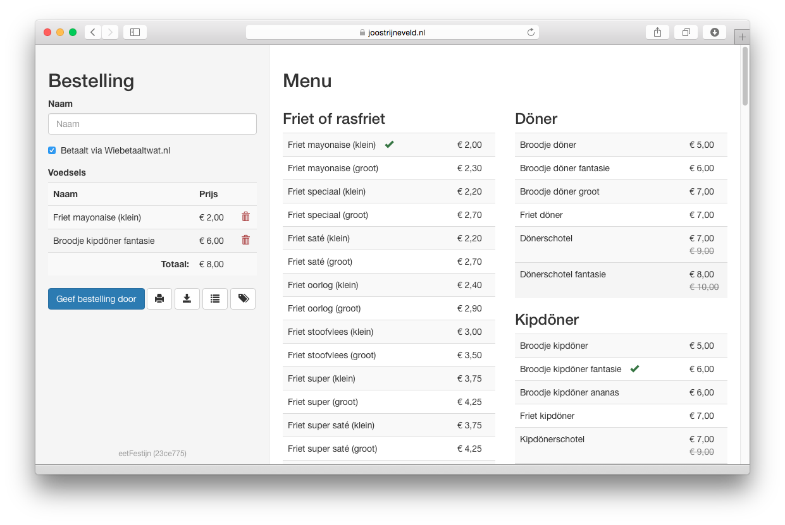

# eetFestijn  

eetFestijn makes it easy to collect take-away orders for a large group. It is especially worthwhile when ordering from the same place on repeated occassions. Using eetFestijn, users can select items from a menu to compose their orders. A complete overview of all orders is automatically generated, as well as a 'simplified' summary that could be printed and taken along.

## Dependencies

The dependencies of eetFestijn are listed in the `requirements.txt` file. Since introducing the 'export to PDF' functionality, the number of dependencies has steeply grown. In order to be able to export PDFs, eetFestijn uses the [WeasyPrint](http://weasyprint.org/) library, converting HTML/CSS to print-ready PDF documents. Unfortunately, the dependencies of WeasyPrint are not all that straightforward. When running `pip install -r requirements.txt`, one might run into any number of the errors involving missing header files. Luckily, they can be trivially fixed by installing a number of development packages. On Debian-based systems, this can be achieved by calling `apt-get install libffi-dev libxml2-dev libxslt1-dev zlib1g-dev`.

After succesfully installing the requirements, you might be faced with an error thrown by Django: `ImportError: cannot import name properties`. In that case, you may need to install `lib-pango`, as follows: `apt-get install libpango1.0-0`.

## Notes on installation

When deploying eetFestijn, be sure to change the `SECRET_KEY` in `eetfestijn/settings.py` and add the appropriate `ALLOWED_HOSTS`. In case you're using eetFestijn for some other menu, you may want to omit the Fest-specific data migrations in `orders/migrations/` (currently migration `0005`, `0006` and `0007`).
